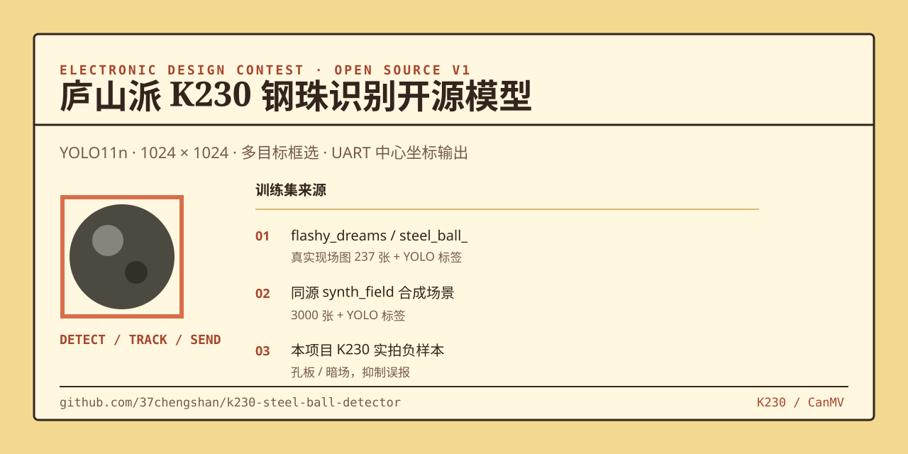

# 电赛 · 庐山派 K230 钢珠识别开源模型



面向 **标准庐山派 K230 + CanMV v1.6** 的钢珠检测训练与部署工程。模型会识别画面中的每颗钢珠；K230 端脚本绘制检测框，并经 UART2 输出钢珠中心坐标。

> 当前推荐版本是 **YOLO26n 第 19 轮、416×416 FP32 KModel**。它已通过 ONNX 与 nncase Simulator 的真实图片一致性验证；**尚未完成实际板卡长时间验证**，请按下方步骤先上板验收。

## 当前推荐版本

- KModel：`models/steel_ball_yolo26n_epoch19_416_fp32.kmodel`
- CanMV 脚本：`canmv/steel_ball_yolo26_uart_epoch19.py`
- 输入：`uint8 NCHW [1,3,416,416]`，编译器内执行 `/255`
- 输出：`[1,300,6]`，每行为 `[x1,y1,x2,y2,confidence,class_id]`
- 板端阈值：`0.30`；脚本直接解析 YOLO26 端到端输出，不套用旧 YOLO11/YOLOv8 解码器
- 三张真实图片验证全部通过，ONNX/KModel 检测数量完全一致，匹配框 IoU 均高于 `0.989`

训练在第 20 轮开始后手动暂停，当前交付权重来自最后完成验证的第 19 轮：

| Precision | Recall | mAP50 | mAP50-95 |
| ---: | ---: | ---: | ---: |
| 0.99028 | 0.97215 | 0.99252 | 0.94404 |

## 历史候选与已知问题

- `models/steel_ball_reference_yolo11n_1024_uint8.kmodel`（v1）在 CanMV 上出现了满屏假框，**不要用于验证**。
- `candidates/v2_raw_graph_f32/` 的 K230 画面仍出现满屏假框，**不要将它用于实际识别**。该候选版的转换参数把模型声明为浮点输入，但板端预处理仍输出 `uint8` 图像，输入契约不匹配。
- 该目录的脚本现已加入原始 KPU 张量诊断。运行一次后，它会打印输出形状、数据类型、最大分数和超过 0.20 的候选数，用于确定 v1 的剩余问题是否为 PTQ 输出量化。
- `candidates/v4_target_pipeline_ptq/` 保留用于复现 1024 PTQ 的异常输出，**不要用于实际识别**。
- `candidates/v5_416_proven_path/` 是当前推荐候选：它还匹配靶子模型的 416 输入和 512×288 摄像头通道，避免 1024 模型的异常输出链路。
- `candidates/v6_416_w16/` 在 v5 的已验证路径上提高权重量化精度，用于减少 K230 量化引入的额外误报。

## 本次发布

| 文件 | 说明 |
| --- | --- |
| `models/steel_ball_yolo26n_epoch19_best.pt` | 当前 YOLO26n 第 19 轮 PyTorch 最佳权重 |
| `models/steel_ball_yolo26n_epoch19_416.onnx` | 416×416、opset 13、端到端输出 ONNX |
| `models/steel_ball_yolo26n_epoch19_416_fp32.kmodel` | 当前推荐的 K230 / nncase 2.11 FP32 KModel |
| `canmv/steel_ball_yolo26_uart_epoch19.py` | 当前推荐的 CanMV v1.6 检测、追踪与 UART 脚本 |
| `docs/yolo26_epoch19_validation.json` | 三张真实图的 ONNX/KModel 一致性验证报告 |
| `models/yolo11n.pt` | Ultralytics YOLO11n 原始预训练权重 |
| `models/steel_ball_reference_yolo11n_1024_best.pt` | 1024×1024 钢珠检测训练最佳权重 |
| `models/steel_ball_reference_yolo11n_1024_uint8.kmodel` | v1 KModel，保留仅用于问题复现，**不要部署** |
| `candidates/v2_raw_graph_f32/` | 修复输入归一化后的 K230 候选模型、脚本和量化记录 |
| `canmv/steel_ball_yolo11_uart.py` | CanMV K230 运行、框选、平滑追踪与 UART 上报脚本 |
| `training/scripts/` | 数据清单构建、训练、ONNX 导出、训练看板脚本 |
| `training/data/k230_hard_examples/` | K230 实拍的孔板、暗场两个空标签负样本 |

旧 YOLO11 高清训练在完成第 40 轮后手动早停，验证集最佳 **mAP50-95 = 0.96108**；该成绩保留作历史对照，不代表旧 KModel 的板端输出正确。当前部署改用上面的 YOLO26 第 19 轮版本。

## 训练数据来源

本训练不上传原始大数据集。数据来源、数量与用途均在此明确列出：

| 来源 | 内容 | 用途 |
| --- | --- | --- |
| [flashy_dreams/steel_ball_](https://gitee.com/flashy_dreams/steel_ball_) | `real_field_sample`：237 张真实现场图及 YOLO 标签 | 训练、验证、真实现场测试 |
| 同一来源 | `synth_field`：3000 张 copy-paste 合成现场图及 YOLO 标签 | 训练、验证 |
| 本项目实拍 | K230 孔板、暗场共 2 张空标签负样本 | 抑制孔板/暗场误报 |

参考数据集和其图片、标签仍受原仓库的许可与使用规则约束；请先阅读其说明，再下载、使用或再发布原始数据。

## 训练

准备 Python、PyTorch 和 Ultralytics 后，在仓库根目录执行：

```powershell
git clone https://gitee.com/flashy_dreams/steel_ball_.git reference/maixcam2-steel-ball-v5
python training/scripts/build_reference_dataset.py
python training/scripts/train_reference.py
```

默认训练为 1024×1024、80 轮、提前停止耐心值 20。若只需快速比较，可使用：

```powershell
python training/scripts/train_reference.py --imgsz 640 --batch 16 --epochs 60 --name steel_ball_reference_yolo11n_640_fast
```

本地训练看板：

```powershell
python training/scripts/training_dashboard.py
```

浏览器打开 `http://127.0.0.1:8765`；左右两侧分别展示高清和快速训练，含曲线与实时终端输出。

## 导出 K230 模型

先导出 nncase 2.11 兼容的 ONNX：

```powershell
python training/scripts/export_k230_onnx.py `
  --weights models/steel_ball_reference_yolo11n_1024_best.pt `
  --output models/steel_ball_reference_yolo11n_1024_raw_uint8.onnx `
  --imgsz 1024 --raw-uint8-input
```

再用与你的 K230 CanMV 固件兼容的 nncase 2.11 工具链完成 PTQ。当前 v2 把 `/255` 归一化写入 ONNX 图，得到：

```text
steel_ball_reference_yolo11n_1024_raw_graph_f32.kmodel
```

量化样本应来自上面下载的 `reference/maixcam2-steel-ball-v5/data/synth_field/images`。量化成功后，把 v2 KModel 放到：

```text
/sdcard/models/steel_ball_reference_yolo11n_1024_raw_graph_f32.kmodel
```

## K230 部署与 UART

将以下两个文件复制到 TF 卡：

```text
仓库 models/steel_ball_yolo26n_epoch19_416_fp32.kmodel
  -> /sdcard/models/steel_ball_yolo26n_epoch19_416_fp32.kmodel

仓库 canmv/steel_ball_yolo26_uart_epoch19.py
  -> /sdcard/steel_ball_yolo26_uart_epoch19.py
```

在 CanMV IDE 中运行 `/sdcard/steel_ball_yolo26_uart_epoch19.py`。首次正常启动应依次看到：

```text
STEEL-BALL-YOLO26-EPOCH19-416-V1
stage=PIPELINE_READY
stage=MODEL_READY contract=[1,300,6]
stage=KPU_OUTPUT shape=(1, 300, 6)
stage=FIRST_FRAME_READY
```

如果输出形状不是 `(1, 300, 6)`，立即停止使用该脚本和模型组合，避免错误解码。

### 历史 YOLO11 部署说明

把 `candidates/v2_raw_graph_f32/steel_ball_yolo11_uart_v2.py` 放到 TF 卡。脚本默认使用 CanMV IDE 虚拟显示，摄像头 AI 画面为 1024×1024。

| 信号 | 标准庐山派 K230 | 说明 |
| --- | --- | --- |
| UART2 TX | GPIO11 / UART2_TXD | 接收端 RX |
| UART2 RX | GPIO12 / UART2_RXD | 接收端 TX，可选 |
| GND | GND | 必须共地 |

UART 为 **115200、3.3 V TTL**，不要接 RS-232 电平。输出格式示例：

```text
BALL,N=3;120,88;251,104;382,301\r\n
```

程序通过两帧确认、短暂滑行保持和坐标平滑，减少检测框与串口坐标闪烁。

## 验收清单

- 孔板、暗场负样本：应输出 `balls=0`。
- 正样本：应打印 `stage=KPU_OUTPUT shape=(1, 300, 6)`，并显示稳定检测框。
- 长时间运行：观察 FPS、内存与 UART 是否持续稳定。
- 本项目尚未完成上述 K230 实机验收；欢迎反馈板卡型号、CanMV 固件版本、首条日志与实际效果。

## 许可与致谢

本仓库新增代码采用 [MIT License](LICENSE)。`yolo11n.pt`、Ultralytics、参考数据集及其衍生内容分别遵循其原始许可；使用前请确认适用条款。

数据参考：[@flashy_dreams](https://gitee.com/flashy_dreams/steel_ball_) 的 MaixCAM2 钢珠检测开源分享。本项目仅复用其标注数据进行 K230 训练；其 MaixCAM2 模型不能直接用于 K230。
